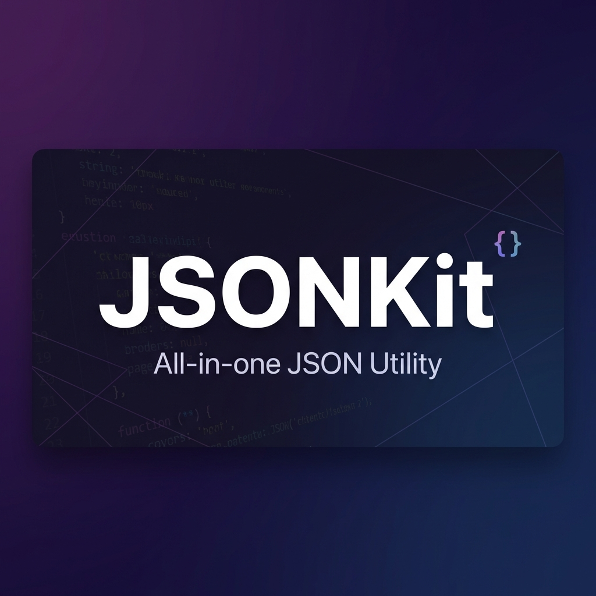

<div align="center">
  

  <br />

  <h1>JSONKit</h1>
  <p><strong>개발자를 위한 올인원 JSON 유틸리티</strong></p>

  [](LICENSE)
  [](https://jsonkit.org)
  [](https://nextjs.org)
  [](https://www.typescriptlang.org/)

  <br />

  [English](./README.md) · [한국어](./README.ko.md)
</div>

<br />

## 소개

**JSONKit**은 개발자를 위한 종합 웹 기반 JSON 유틸리티 도구입니다. 복잡한 JSON을 포맷팅하거나, 문법을 검증하거나, 구조를 시각화하거나, 데이터 형식을 변환해야 할 때, JSONKit은 빠르고 안전한 클라이언트 사이드 환경을 제공합니다.

## 주요 기능

- **JSON 정리 & 압축**: JSON 데이터를 즉시 포맷팅하거나 압축합니다.
- **JSON 검증기**: 상세한 오류 보고와 함께 엄격한 문법 검사를 수행합니다.
- **트리 뷰어**: 쉬운 탐색을 위한 대화형 접이식 트리 구조를 제공합니다.
- **비교 도구**: 두 JSON 파일 간의 차이점을 나란히 비교합니다.
- **변환기**: JSON을 YAML, XML, CSV로 변환하거나 그 반대로 변환합니다.
- **JSONPath 쿼리**: 강력한 JSONPath 표현식으로 JSON에서 데이터를 추출합니다.
- **이스케이프 & 언이스케이프**: JSON 문자열을 임베딩용으로 이스케이프하거나 원래대로 복원합니다.
- **JSON 복구**: 일반적인 문제가 있는 잘못된 JSON을 자동으로 수정합니다.
- **스키마 검증기**: JSON Schema 정의에 대해 JSON 데이터를 검증합니다.
- **개인정보 보호 우선**: 모든 처리는 클라이언트 측에서 이루어집니다. 데이터가 브라우저를 벗어나지 않습니다.

## 기술 스택

- **프레임워크**: [Next.js 16](https://nextjs.org/) (App Router)
- **언어**: [TypeScript](https://www.typescriptlang.org/)
- **스타일링**: [Tailwind CSS](https://tailwindcss.com/) & [Shadcn UI](https://ui.shadcn.com/)
- **상태 관리**: [Zustand](https://docs.pmnd.rs/zustand)
- **에디터**: [Monaco Editor](https://microsoft.github.io/monaco-editor/)
- **배포**: [Vercel](https://vercel.com)

## 시작하기

### 사전 요구사항

- Node.js 20+
- npm, yarn, 또는 pnpm

### 설치

1. 저장소 클론:
   ```bash
   git clone https://github.com/Ktaewon/jsonkit.git
   cd jsonkit
   ```

2. 의존성 설치:
   ```bash
   npm install
   # 또는
   yarn install
   ```

3. 환경 변수 설정:
   `.env.example`을 `.env.local`로 복사하고 키를 추가합니다 (로컬 개발 시 선택사항).
   ```bash
   cp .env.example .env.local
   ```

4. 개발 서버 실행:
   ```bash
   npm run dev
   ```

5. 브라우저에서 [http://localhost:3000](http://localhost:3000)을 엽니다.

## 기여하기

기여를 환영합니다! Pull Request를 자유롭게 제출해 주세요.

1. 프로젝트 Fork
2. Feature 브랜치 생성 (`git checkout -b feature/AmazingFeature`)
3. 변경사항 커밋 (`git commit -m 'Add some AmazingFeature'`)
4. 브랜치에 Push (`git push origin feature/AmazingFeature`)
5. Pull Request 열기

## 라이센스

이 프로젝트는 MIT 라이센스에 따라 라이센스가 부여됩니다 - 자세한 내용은 [LICENSE](LICENSE) 파일을 참조하세요.

---

<div align="center">
  Made with ❤️ by <a href="https://github.com/Ktaewon">Ktaewon</a>
</div>
