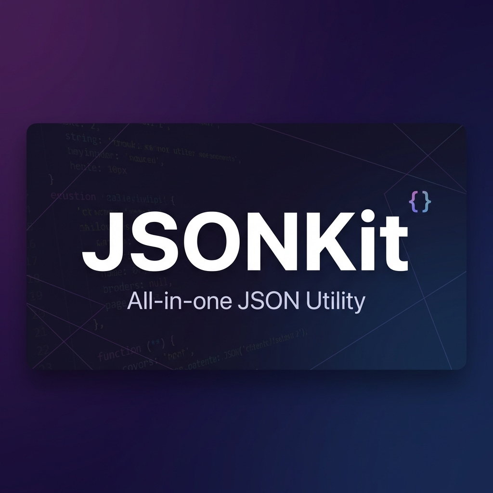

<div align="center">
  
  
  <br />
  
  <h1>JSONKit</h1>
  <p><strong>All-in-one JSON Utility for Developers</strong></p>

[](LICENSE)
[](https://jsonkit.org)
[](https://nextjs.org)
[](https://www.typescriptlang.org/)

  <br />

[English](./README.md) · [한국어](./README.ko.md)

</div>

<br />

## 🚀 Introduction

**JSONKit** is a comprehensive web-based utility tool designed to simplify JSON manipulation for developers. Whether you need to format messy JSON, validate syntax, view complex structures, or convert data types, JSONKit provides a fast, client-side secure environment to get the job done.

## ✨ Features

- **🎨 JSON Beautifier & Minifier**: Instantly format or compress your JSON data.
- **✅ JSON Validator**: Strict syntax checking with detailed error reporting.
- **🌳 Tree Viewer**: Interactive collapsible tree structure for easy navigation.
- **🔀 Diff & Compare**: Side-by-side comparison to find differences between two JSON files.
- **🔄 Converter**: Convert JSON to YAML, XML, CSV and vice-versa.
- **🔍 JSONPath Query**: Extract data from JSON using powerful JSONPath expressions.
- **📝 Escape & Unescape**: Escape JSON strings for embedding or unescape them back.
- **🔧 JSON Repair**: Automatically fix malformed JSON with common issues.
- **📋 Schema Validator**: Validate JSON data against JSON Schema definitions.
- **💻 JSON to Code**: Generate type definitions and class structures for TypeScript, Go, Python, and more.
- **📊 Graph Visualizer**: Visualize JSON as an interactive node graph with automatic hierarchical layout.
- **🔒 Privacy First**: All processing happens client-side. Your data never leaves your browser.

## 🛠️ Tech Stack

- **Framework**: [Next.js 16](https://nextjs.org/) (App Router)
- **Language**: [TypeScript](https://www.typescriptlang.org/)
- **Styling**: [Tailwind CSS](https://tailwindcss.com/) & [Shadcn UI](https://ui.shadcn.com/)
- **State Management**: [Zustand](https://docs.pmnd.rs/zustand)
- **Editor**: [Monaco Editor](https://microsoft.github.io/monaco-editor/)
- **Deployment**: [Vercel](https://vercel.com)

## 🏃 Getting Started

### Prerequisites

- Node.js 20+
- npm, yarn, or pnpm

### Installation

1. Clone the repository:

   ```bash
   git clone https://github.com/Ktaewon/jsonkit.git
   cd jsonkit
   ```

2. Install dependencies:

   ```bash
   npm install
   # or
   yarn install
   ```

3. Set up environment variables:
   Copy `.env.example` to `.env.local` and add your keys (optional for local dev).

   ```bash
   cp .env.example .env.local
   ```

4. Run the development server:

   ```bash
   npm run dev
   ```

5. Open [http://localhost:3000](http://localhost:3000) in your browser.

## 🤝 Contributing

Contributions are welcome! Please feel free to submit a Pull Request.

1. Fork the Project
2. Create your Feature Branch (`git checkout -b feature/AmazingFeature`)
3. Commit your Changes (`git commit -m 'Add some AmazingFeature'`)
4. Push to the Branch (`git push origin feature/AmazingFeature`)
5. Open a Pull Request

## 📄 License

This project is licensed under the MIT License - see the [LICENSE](LICENSE) file for details.

---

<div align="center">
  Made with ❤️ by <a href="https://github.com/Ktaewon">Ktaewon</a>
</div>
